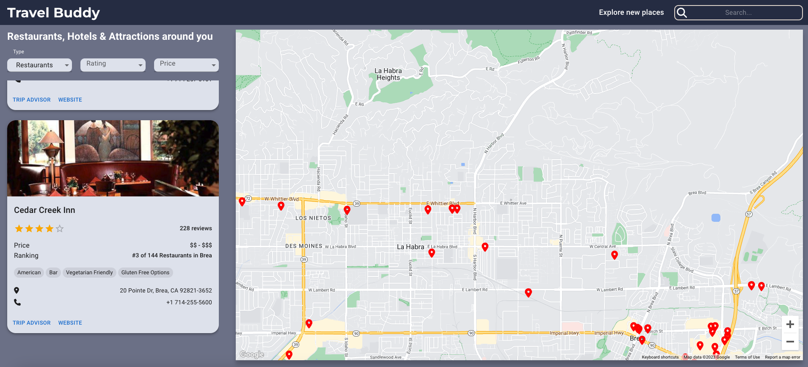
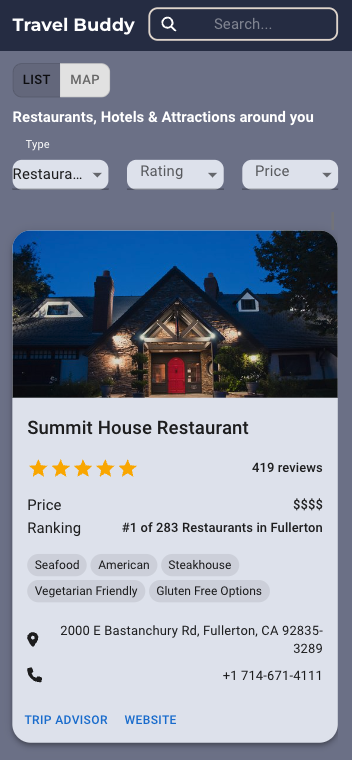
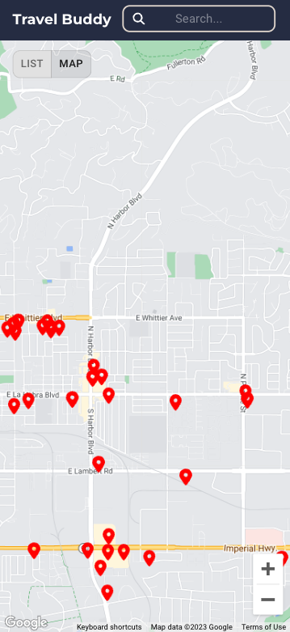

# Travel Buddy - Find New Places to Explore

## Table of contents

- [Overview](#overview)
  - [App Summary](#app-summary)
  - [Screenshots](#screenshots)
  - [Links](#links)
- [My process](#my-process)
  - [Built with](#built-with)
  - [What I learned](#what-i-learned)
  - [Continued development](#continued-development)
  - [Useful resources](#useful-resources)
- [Author](#author)

## Overview

### App Summary

Travel Buddy is an app that helps users find restaurants, hotels, and attractions in any city around the world. The app uses Google Maps Autocomplete to find the geographic coordinates of the desired location and then renders a map using Google Maps. With Travel Buddy, users can quickly and easily explore their destination and plan their itinerary.

### Screenshots





### Links

- Live Site URL: [Click to View App](travel-bud-react.netlify.app/)

## My process

### Built with


### What I learned

**app.jsx**
```js
async function getPlaces(type, sw, ne) {
    const places = await getPlacesData(type, sw, ne);
    setFilteredPlaces([]);
    setRating('');
    setPriceSort('');
    if (places) {
      places.forEach((place) => {
        place.price_level ? 
          place['price_ranking'] = PRICE_RANKINGS[place.price_level] 
          : 
          place['price_ranking'] = 0;
      });
      setPlaces(places.filter((place) => place.name && place.num_reviews > 0));
      setIsLoading(false);
    } else {
      setPlaces([]);
      setIsLoading(false);
    }
}
```

### Future Development


## Author

- Website - [Adam Ascencio](https://adamdevs.vercel.app/)